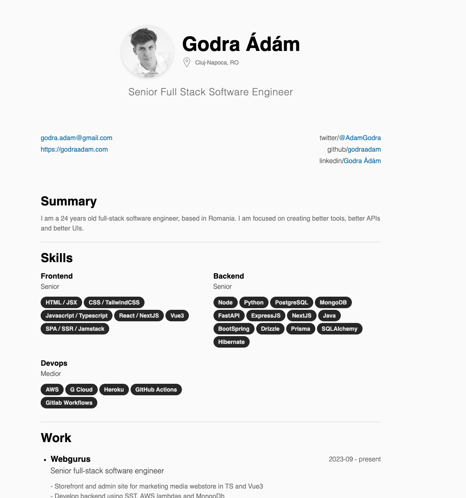
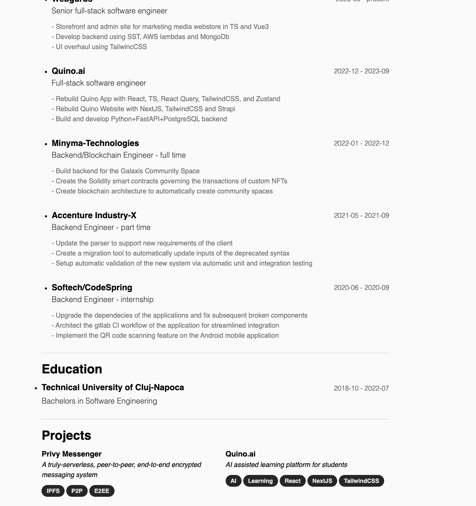

# JSON Resume Minyma Theme
 This is a theme for [JSON resume](https://jsonresume.org/): an awesome open source project for generating uniform resumes, with free hosting and customizable themes.
 
 ## Useage
 
 ### Prerequisites
 ```
 npm i -g resume-cli
 ```
 ### Create your resume json
 ```
 touch resume.json
 ```
 ### Install the theme
 ```
 npm i jsonresume-theme-minyma
 resume export resume.pdf --theme minyma
 resume export resume.html --theme minyma
 ```
 
 ## Screenshots
 
 ---
 
 
 ## Features
 - [x] Responsive
 - [ ] Dark mode variant: coming soon...
  
## Supported fields ( see [schema](https://jsonresume.org/schema/))
 - [x] Avatar image
 - [x] Profiles
 - [x] Email
 - [x] Phone number
 - [x] Personal site
 - [x] Work
 - [x] Education
 - [x] Projects
 - [x] Skills
 - [x] Languages
 - [x] Interests
 - [x] Awards
 - [x] Certificates
 - [x] Publications
 - [x] Location
 - [ ] Volunteer
 - [ ] References

## Contribute

This project uses [Handlebars](https://handlebarsjs.com/) and [TailwindCSS](https://tailwindcss.com/)
```
git clone git@github.com/godraadam/jsonresume-minyma.git
cd jsonresume-minyma
npm install
npm run dev
```
- create branch `feature/my-feature`
- make changes in `src/template.hbs`
- commit, publish branch
- open pull request